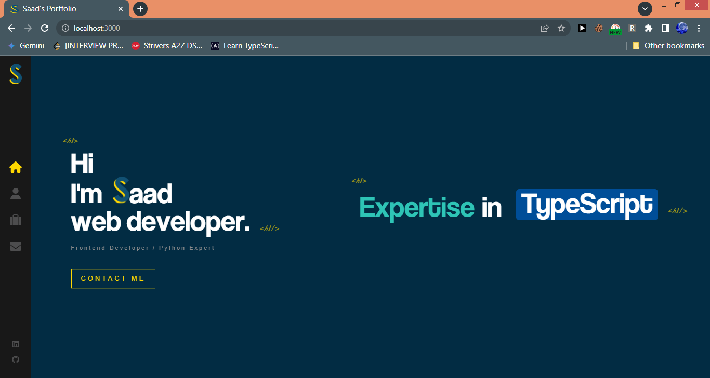
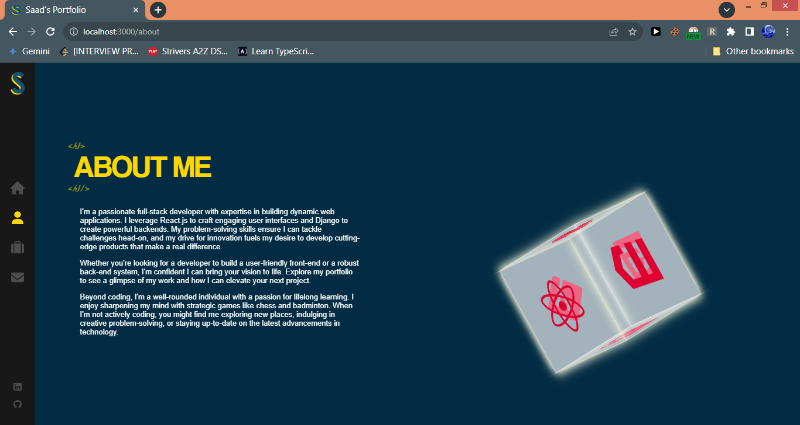
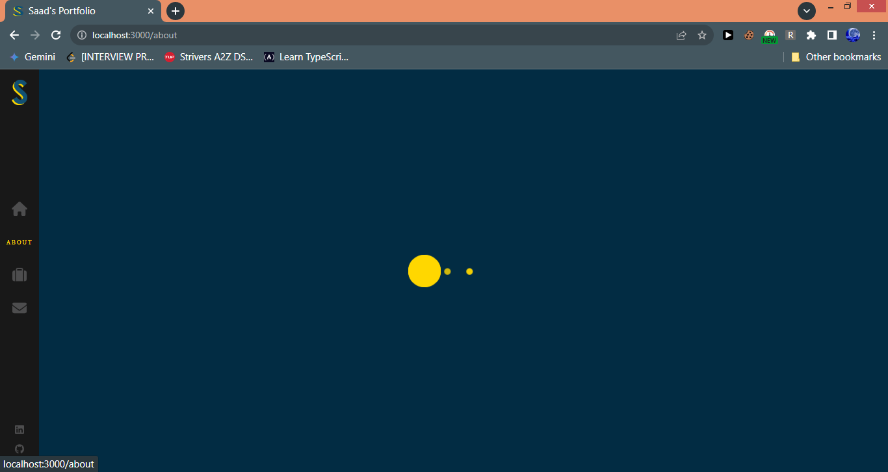
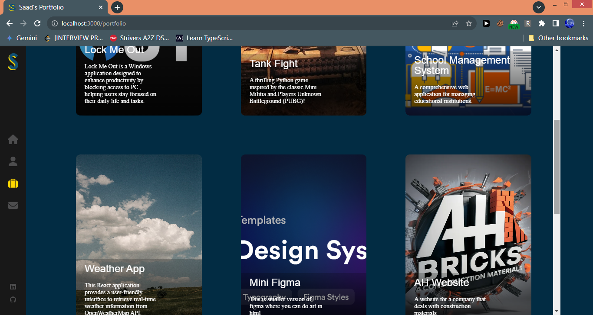
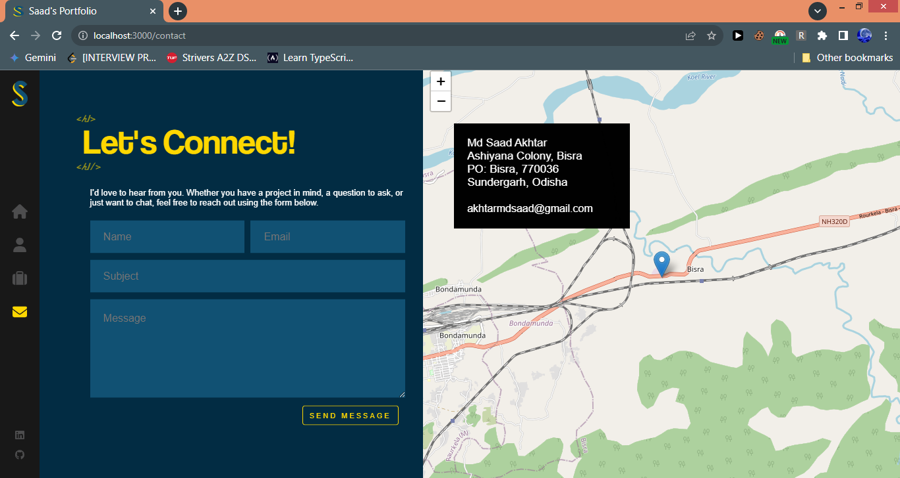

**Project Name:** Portfolio Website

**Description:**

This React application serves as a comprehensive and visually appealing portfolio showcasing my skills and experience. Built with a focus on modern web development trends, it leverages the power of various technologies to provide an interactive and informative user experience.

**Screenshots**







**Key Features:**

* **React Framework:** Employs React for building dynamic and reusable components, ensuring a performant and adaptable website.
* **SCSS Preprocessor:** Utilizes SCSS to maintain clean, modular, and reusable styles, promoting maintainability and consistency.
* **Firebase Integration:** Integrates Firebase for dynamic data fetching (e.g., project details).
* **EmailJS Integration:** Integrates EmailJS to enable contact form functionality, allowing potential employers or clients to reach out directly through the website.
* **React Leaflet:** Implements React Leaflet for interactive map integration, potentially displaying the location.
* **Fort Awesome:** Leverages Fort Awesome for a vast library of icons, enhancing visual appeal and clarity.
* **Animate.css :** Utilizes Animate.css to add subtle animations and transitions, elevating user engagement.

**Technologies Used:**

* **Front-End:**
    * React
    * SCSS
    * Font Awesome
    * Animate.css
* **Back-End :**
    * Firebase (for data management)
* **Third-Party Integrations:**
    * React Leaflet
    * EmailJS

**Installation:**

1. **Clone the Repository:**
   ```bash
   git clone https://github.com/akhtarmdsaad/portfolio-website.git
   ```
2. **Install Dependencies:**
   Navigate to the project directory and run:
   ```bash
   npm install
   ```

**Running the Application:**

1. **Start the Development Server:**
   ```bash
   npm start
   ```
   This typically launches the app in your default web browser, usually at `http://localhost:3000` (port may vary).

**Deployment:**

This website is currently deployed and accessible at ``.

## Contribution

We welcome contributions to this project! Here's how you can get involved:

* **Fork the Repository:** Create a copy of the repository on your GitHub account using the "Fork" button.
* **Clone your Fork:** Clone your forked repository to your local machine.
* **Make Changes:** Make your desired changes to the codebase.
* **Update CONTRIBUTING.md**: Add your name in `CONTRIBUTING.md` file.
* **Commit your Changes:** Commit your changes locally with a descriptive commit message.
* **Push your Changes:** Push your changes to your forked repository on GitHub.
* **Create a Pull Request:** Create a pull request from your forked repository to the main repository.
* **Review and Discussion:** We will review your pull request and discuss any necessary changes before merging it into the main branch.

**Before submitting a pull request:**

* Please ensure your code adheres to the project's coding style and conventions.
* Consider writing unit tests for your changes to ensure code quality.


## Development

This project welcomes developers of all levels to contribute and learn. Here are some pointers to get you started:

* **Development Environment:** Set up your preferred development environment with Node.js, npm (or yarn), and a code editor or IDE.
* **Codebase Structure:** Familiarize yourself with the project's directory structure and code organization.
* **Running the Application:** Follow the installation and running instructions provided in the "Installation" section.
* **Testing:** Unit tests are encouraged for core functionalities. Consider adding or modifying tests for your changes.
* **Coding Style:** Adhere to the project's coding style and conventions to maintain code readability and consistency.
* **Documentation:** Update the README.md file if your changes introduce new features or modifications to existing functionalities.


Remember, collaboration is key! Feel free to reach out with any questions or suggestions.
